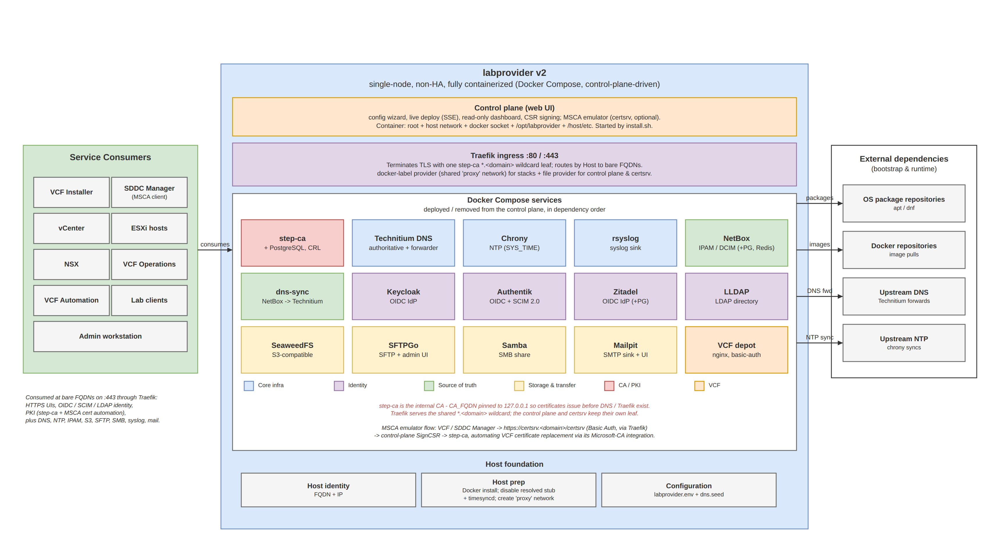

# labprovider

labprovider is a lightweight, single-node platform for standing up shared infrastructure services on a single dedicated host. It provides a self-contained infrastructure services layer for lab environments.

It is designed for lab and proof-of-concept environments, especially VMware Cloud Foundation (VCF). Services (all containerized via Docker Compose):

- DNS via Technitium (NetBox-driven)
- dns-sync for reconciling NetBox IPAM records into Technitium
- Chrony for NTP (containerized; image built locally)
- rsyslog for centralized syslog collection (containerized; image built locally)
- step-ca for a lightweight private certificate authority (dedicated PostgreSQL backend)
- VCF offline depot served by nginx
- Keycloak for identity
- Authentik for identity federation with OIDC and outbound SCIM 2.0 provisioning
- Zitadel for identity with OIDC (Management API-provisioned bootstrap client, optional multi-tenant orgs)
- NetBox for IPAM, DCIM, and infrastructure source-of-truth
- SeaweedFS for S3-compatible object storage
- SFTPGo for SFTP file transfer
- Mailpit as an SMTP sink for inspecting mail lab services send (vCenter, SDDC Manager, Aria)
- LLDAP for a lightweight LDAP/LDAPS directory the OIDC providers can federate
- Samba for an SMB/CIFS file share (containerized; image built locally)
- PyKMIP as a KMIP 1.2 key server, so the VCF encryption workflows (vSAN encryption, VM encryption) can be exercised
- The labprovider control plane: a web UI with a configuration wizard, service selection + deployment with live progress, a read-only dashboard, CSR signing, and an optional Microsoft-CA web-enrollment emulator for VCF

## labprovider v2: the control plane

labprovider is derived from Rutger Blom's provider-box. Where the original relied on a CLI bash bootstrap, labprovider v2 replaces it entirely with a docker-based control plane that owns config, deploy, and dashboard. One script installs it; everything else happens in the browser:

```bash
git clone https://github.com/dsjodin/labprovider.git
cd labprovider
sudo bash install.sh
```

`install.sh` is the only shell in v2. It installs Docker if absent (Debian and Ubuntu), does the one-time host preparation (disables the systemd-resolved stub listener so Technitium can own port 53, disables systemd-timesyncd because chrony runs containerized), builds the control-plane image from the checkout, and starts it (root, host network, with the docker socket, `/opt/labprovider`, and `/host/etc` mounted). It prints the UI URL when done (port 8445 by default).

Then, in the UI:

1. **`/config`** - edit or paste `labprovider.env` (or download it, fill it out locally, and paste it back), validate (every problem is reported at once, per variable), and save. Optional external DNS records (`dns.seed`) are managed on the same page.
2. **`/deploy`** - tick the services you want (dependencies are added automatically), press Deploy, and watch the live log stream over SSE. "Select all" deploys the full catalog in dependency order: chrony, rsyslog, ca, technitium, traefik, depot, keycloak, authentik, zitadel, netbox, s3, sftp, mailpit, lldap, samba, kmip, dns-sync.
3. **`/`** - the dashboard: certificates (step-ca), DNS zones (Technitium), IPAM (NetBox), container state, and recent errors at a glance.
4. **`/csr`** - paste a PKCS#10 CSR and have step-ca sign it, returning the full chain.

After the CA is deployed the control plane issues its own certificate; restart the container (`docker restart labprovider-control-plane`) to serve the UI over HTTPS.

**The UI requires an operator login.** On a fresh install `/setup` creates the
first account; every other page and API endpoint returns 401 or redirects to
`/login` until you sign in. Accounts live in `users.json` (mode 0600, bcrypt
hashes) next to the managed config, sessions are held in memory with a 12 hour
idle timeout, and `/account` changes your password. Note that the first sign-in
happens over plain HTTP, before step-ca has issued the control plane its own
certificate - so run this on a trusted lab network.

### Required open ports

`install.sh` and the control plane do not manage the firewall. If the host runs ufw or similar, open the service ports you deploy:

| Service | Ports |
|---------|-------|
| Control plane UI | 8445/tcp |
| MSCA emulator (optional) | 8446/tcp (VMSCA_PORT) |
| Technitium DNS | 53/tcp+udp, 5380/tcp, 53443/tcp, 67/udp when `DHCP_ENABLE="true"` |
| Chrony (NTP) | 123/udp (clients point at `NTP_FQDN`, e.g. `ntp.<domain>`) |
| rsyslog | 514/tcp+udp (SYSLOG_PORT) |
| step-ca | 9000/tcp |
| Depot | 80/tcp, 443/tcp |
| Keycloak | 8443/tcp |
| Authentik | 9443/tcp |
| Zitadel | 7443/tcp |
| NetBox | 8444/tcp |
| S3 | 8333/tcp |
| SFTPGo | 2022/tcp, 8080/tcp |
| Mailpit | 1025/tcp (SMTP, MAILPIT_SMTP_PORT) |
| LLDAP | 3890/tcp (LDAP), 6360/tcp (LDAPS) |
| Samba | 445/tcp (SAMBA_PORT) |
| KMIP | 5696/tcp (KMIP_PORT) |

Ports are the example-config defaults; adjust to your values. Mailpit's UI and
LLDAP's admin UI are reached through Traefik on 443 at their FQDNs; their host
ports (`MAILPIT_UI_PORT`, `LLDAP_UI_PORT`) are bound to the loopback for
readiness only.

### Reverse proxy (Traefik)

A single Traefik ingress on `:80`/`:443` fronts the
HTTP(S) services so you reach each at its bare FQDN with no port -
`https://netbox.sddc.lab`, `https://certsrv.sddc.lab/certsrv`, and so on. Traefik
terminates TLS with one step-ca-issued `*.<SEARCH_DOMAIN>` wildcard leaf (served
as its default certificate) and routes by `Host`:

- bridge service stacks are discovered via docker labels on a shared external
  `proxy` network, created by `install.sh`;
- the host-networked control plane and the certsrv emulator are wired through
  Traefik's file provider (reachable at `https://dashboard.<domain>` and
  `https://certsrv.<domain>`).

Because it holds `:80`/`:443`, open those in the firewall when Traefik is enabled.
The non-HTTP services keep their own ports regardless: DNS (53), NTP (123), syslog
(514), SFTP (2022), and step-ca (9000). This is a lab-grade setup: Traefik talks
plain HTTP to backends over the `proxy` network.

Every HTTP(S) service is fronted by Traefik: the control plane, certsrv, the
Technitium web console, NetBox, Keycloak, Authentik, Zitadel, the depot, SeaweedFS
S3 (path-style: `https://s3.<domain>/<bucket>`), and the SFTPGo admin UI. Each
backend serves plain HTTP over the `proxy` network and keeps a loopback-published
port for deploy-time readiness. step-ca stays on `:9000`, and the L4 services keep
their ports as listed above.

The deploy page pre-selects a foundation set (`ca`, `technitium`, `traefik`,
`netbox`, `dns-sync`) and greys out - and the API rejects - every other service
until all five are deployed and up.

## The first 15 minutes

The short path from a clean host to a working lab. Everything here is expanded
on later; this is the order to do it in.

1. **Install.** `git clone`, then `sudo bash install.sh`. It prints the UI URL
   when the control plane is up (`http://<host>:8445`).
2. **Create the operator account.** The first visit lands on `/setup`. Nothing
   else is reachable until you do this.
3. **Fill in six values.** Open `/config` and edit the pasted example. These are
   the ones that are actually about *your* lab; the rest of the file can stay at
   its defaults for a first run:

   | Variable | What it is |
   |---|---|
   | `HOST_IP` | This host's address in CIDR notation, e.g. `192.168.12.121/24` |
   | `SEARCH_DOMAIN` | The lab domain every service name hangs off, e.g. `sddc.lab` |
   | `DNS_FORWARDER` | The upstream resolver Technitium forwards to |
   | `LABPROVIDER_FQDN` | This host's canonical name |
   | `CHRONY_SERVER_1..3` | Upstream NTP servers |
   | The remaining `CHANGE_ME` values | Admin passwords. The machine-to-machine secrets are generated for you - leave those empty |

   Press Validate: every problem in the file is reported at once, per variable.
   Save when it comes back clean.
4. **Deploy the foundation.** On `/deploy`, the five foundation services (`ca`,
   `technitium`, `traefik`, `netbox`, `dns-sync`) are pre-selected. Press Deploy
   and watch the log stream. Nothing else can be deployed until these are up.
5. **Restart the control plane** so it serves HTTPS with the certificate it just
   issued itself: `docker restart labprovider-control-plane`.
6. **Verify.** One command, from the host:

   ```bash
   dig +short @127.0.0.1 dashboard.$SEARCH_DOMAIN
   ```

   An answer means DNS, NetBox, and dns-sync are all doing their jobs. Then open
   `https://dashboard.<SEARCH_DOMAIN>` - the dashboard shows certificates, DNS
   zones, IPAM, disk, and container state.

Then pick the rest of what you need on `/deploy`. See
[Choosing Services](#choosing-services) for which ones matter for VCF.

## Overview


*labprovider v2 architecture: the control plane, the containerized Docker Compose services, the host foundation, and external dependencies.*

## Documentation

This file is the install and the first fifteen minutes. Everything else lives
next to it, one file per question:

- **[docs/SERVICES.md](docs/SERVICES.md)** - what each service is, why it is
  here, what it is wired to, and the per-service notes. Start here when
  choosing what to deploy.
- **[docs/OPERATIONS.md](docs/OPERATIONS.md)** - configuration, host
  assumptions, the runtime model, deploying and upgrading, backup and restore,
  secrets, and troubleshooting. Start here when something is already running.
- **[AGENTS.md](AGENTS.md)** - the constraints this project is built under.
  Read before changing anything.
- **[CHANGELOG.md](CHANGELOG.md)** - what shipped, when.

## Design Trade-offs

labprovider is intentionally single-node and not highly available.

It prioritizes:

- simplicity
- reproducibility
- low resource footprint

Over:

- redundancy
- production-grade resilience
- orchestration complexity

It is opinionated for labs and PoCs, not for HA production deployment patterns.

## Repository Layout

```text
install.sh          The only shell: Docker install, host prep, build + run the control plane

README.md           This file: the operator manual
AGENTS.md           Implementation rules, architectural boundaries, and scope
CHANGELOG.md        History

config/
  dns.seed.example
  labprovider.env.example   The schema source of truth and completeness reference

services/
  control-plane/    Go control plane: config wizard, deploy engine (SSE progress),
                    read-only dashboard, CSR signing, MSCA emulator. Deployers live
                    under internal/deploy/ (one file per service); templates are
                    embedded Go text/template under internal/deploy/templates/.
  dns-sync/         Go source for the dns-sync and dns-seed binaries (image built
                    locally, baked into the control-plane image)

docs/
  CODE_REVIEW.md          Defect review
  IMPROVEMENT_PLAN.md     Process, structure, and operations review
  COMPARISON_VIS.md       Comparison against the VCF Infrastructure Services Appliance
  IMPLEMENTATION_PLAN.md  The merged, ordered backlog and what has been done
  design/           Pre-implementation design notes, kept as history
  images/           Architecture diagram sources and exports
```

## Scope

labprovider focuses on a simple, modular, and reproducible way to deploy shared infrastructure services on a single host for lab and PoC environments.

It is intentionally:

- fully containerized
- control-plane driven
- template-driven
- explicit
- single-node
- easy to reason about

It does not aim to introduce orchestration layers, HA patterns, or broad production abstractions.
